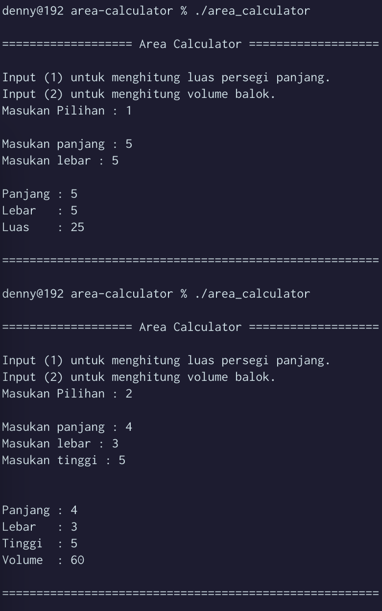

# Team Assignment

The following source code is used as an answer to a group assignment in the object oriented programming course.

## Group members
| Student ID |             Name           |
|:----------:|:-------------------------- |
| 2201825812 |   Muhammad Yusuf Ramadhan  |
| 2502078901 | Zetta Septian Nugroho Adhi |
| 2502163991 |        Denny Setiawan      |
| 2502102541 |  Edbert Callisti Wiryalim  | 

## Question
Buatlah program untuk menghitung luas persegi panjang dan balok, menggunakan fungsi pewarisan untuk penerapannya :

aturan keluaran sebagai berikut:
```
Superclass PersegiPanjang
Panjang : 5
Lebar : 5
Luas : 25

Subclass Balok
Panjang : 4
Lebar : 3
Tinggi : 5
Volume : 60

```

## Output of the Answer 
