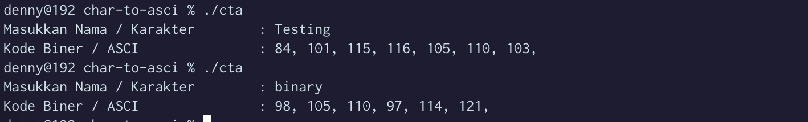

# Team Assignment

The following source code is used as an answer to a group assignment in the object oriented programming course.

## Group members
| Student ID |             Name           |
|:----------:|:-------------------------- |
| 2201825812 |   Muhammad Yusuf Ramadhan  |
| 2502078901 | Zetta Septian Nugroho Adhi |
| 2502163991 |        Denny Setiawan      |
| 2502102541 |  Edbert Callisti Wiryalim  | 

## Question
Buatlah program untuk mengubah karakter huruf menjadi kode ASCII
Keluaran yang diinginkan adalah:

```
    Masukan Nama /  Karakter 	: 
    Kode Biner				    : 
```

## Output of the Answer 
