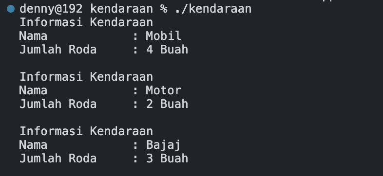

# Team Assignment

The following source code is used as an answer to a group assignment in the object oriented programming course.

## Question
Kelas dasar adalah Kendaraan. Kelas turunan dari kelas Kendaraan adalah kelas Mobil, kelas Motor dan kelas Bajaj.  Pada kelas Kendaraan terdapat informasi mengenai nama kendaraan dan jumlah roda kendaraan. Informasi nama dan jumlah kendaraan dapat diperoleh dari kelas turunannya.  Buatlah program tersebut menggunakan konsep polymorphism dengan fungsi pure virtual ! Contoh output:

aturan keluaran sebagai berikut:
```
Informasi Kendaraan
Nama   = Mobil
Jumlah Roda    = 4 Buah

Informasi Kendaraan
Nama   = Motor 
Jumlah Roda    = 2 Buah

Informasi Kendaraan
Nama   = Bajaj
Jumlah Roda    = 3 Buah
```

## Output of the Answer 
