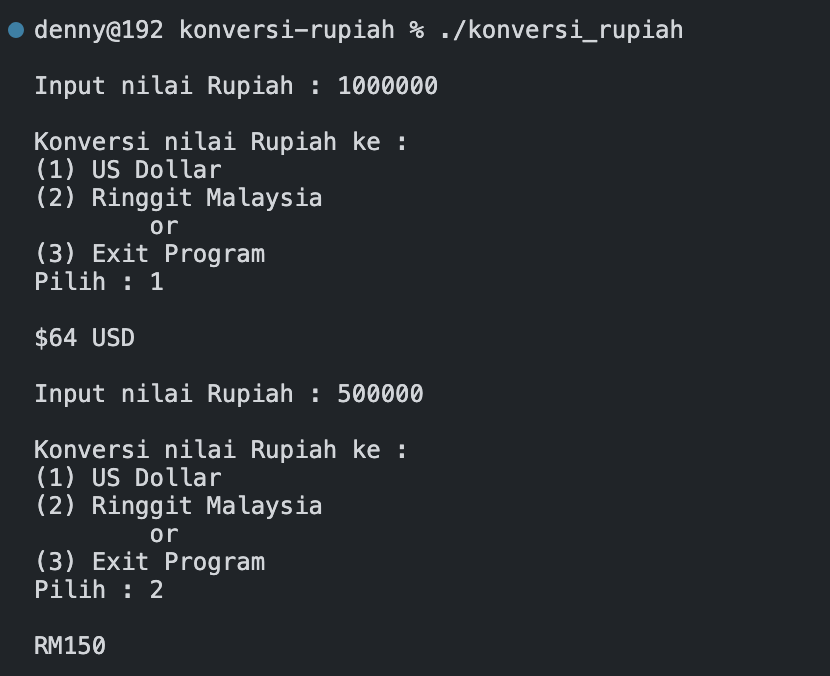

# Personal Assignment

The following source code is used as an answer to a group assignment in the object oriented programming course.

## Question
Buatlah Program konversi nilai mata uang rupiah ke beberapa negara.
a. US Dollar
b. Ringgit Malaysia

Sistem akan mengkonversi berdasarkan nilai inputan
```
Program Konversi Mata Uang
Input = 
Pilih konversi
a.	US Dollar
b.	Ringgit Malaysia
```

## Output of the Answer 
