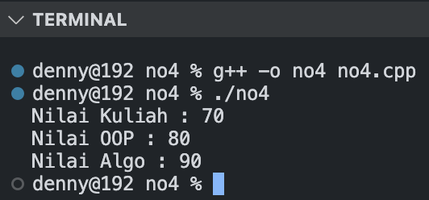

## Question
```
Kasus:
int main() {
   Kuliah myKuliah;
   Oop myOop;
   Alprog myAlprog;
   myKuliah.getNilai();
   myOop.getNilai();
   myAlprog.getNilai();
   return 0;
};

Case: Silahkan lengkapi struktur program di atas untuk menjelaskan konsep Inheritance dengan turunan class sebagai berikut:
i. Kuliah = base class
ii. Oop = derived class dari kelas Kuliah
iii. Alprog = derived class dari kelas Kuliah
```

## Output of the Answer 
