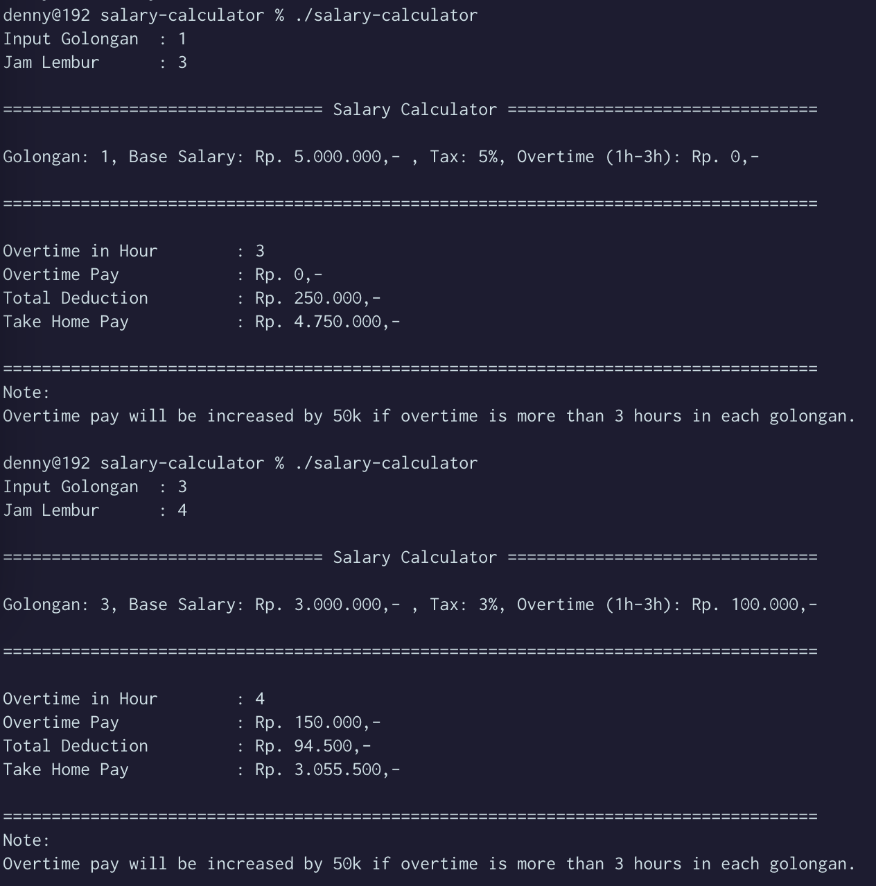

# Team Assignment

The following source code is used as an answer to a group assignment in the object oriented programming course.

## Group members
| Student ID |             Name           |
|:----------:|:-------------------------- |
| 2201825812 |   Muhammad Yusuf Ramadhan  |
| 2502078901 | Zetta Septian Nugroho Adhi |
| 2502163991 |        Denny Setiawan      |
| 2502102541 |  Edbert Callisti Wiryalim  | 

## Question

Buatlah Program untuk menghitung gaji karyawan dengan petunjuk sebagai berikut:

| No | Golongan | Nilai Gaji |
|:--:|:--: | :--: |
| 1 | 1 | 5.000.000 |
| 2 | 2 | 4.000.000 |
| 3 | 3 | 3.000.000 |
| 3 | 4 | 2.000.000 |

| No | Pajak | Nilai |
|:--:|:--: | :--: |
| 1 | Golongan 1 | 5% |
| 2 | Golongan 2 | 4% |
| 3 | Golongan 3 | 3% |
| 3 | Golongan 4 | 2% |

| No | Tipe | Lemburan | Nilai Rupiah |
|:--:|:--: | :--: | :--: |
| 1 | Golongan 1 | - | - |
| 2 | Golongan 2 | - | - |
| 3 | Golongan 3 | 1-3 Jam | 100.000 |
| 3 | Golongan 4 | 1-3 Jam | 150.000 |

Untuk lemburan jika lebih dari waktu lemburan yang ditentukan maka nilai rupiah akan bertambah 50.000 untuk setiap golongan yang masih mendapatkan lemburan.

Rumus gaji adalah `Nilai Gaji + lemburan / pajak`.

Hasil keluaran yang diinginkan adalah:
> Golongan 	: 1
> Lemburan 	: 3 Jam
> Gaji		: 4.750.000

> Golongan 	: 3
> Lemburan 	: 4 Jam
> Gaji		: 3.055.500

## Output of the Answer 
