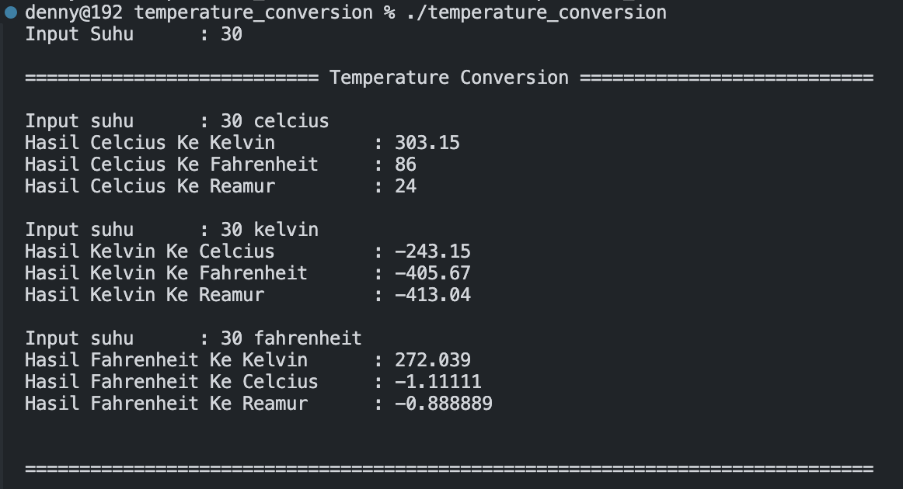

# Team Assignment

The following source code is used as an answer to a group assignment in the object oriented programming course.

## Group members
| Student ID |             Name           |
|:----------:|:-------------------------- |
| 2201825812 |   Muhammad Yusuf Ramadhan  |
| 2502078901 | Zetta Septian Nugroho Adhi |
| 2502163991 |        Denny Setiawan      |
| 2502102541 |  Edbert Callisti Wiryalim  | 

## Question
Buatlah program untuk melakukan konversi dari suhu  
- Kelvin
- Fahrenheit
- Celcius

Hasil keluaran yang diinginkan adalah:
```
Input suhu      : 30 celcius
Hasil Celcius Ke Kelvin         : 303.15
Hasil Celcius Ke Fahrenheit     : 86
Hasil Celcius Ke Reamur         : 24

Input suhu      : 30 kelvin
Hasil Kelvin Ke Celcius         : -243.15
Hasil Kelvin Ke Fahrenheit      : -405.67
Hasil Kelvin Ke Reamur          : -413.04

Input suhu      : 30 fahrenheit
Hasil Fahrenheit Ke Kelvin      : 272.039
Hasil Fahrenheit Ke Celcius     : -1.11111
Hasil Fahrenheit Ke Reamur      : -0.888889
```

## Output of the Answer 
